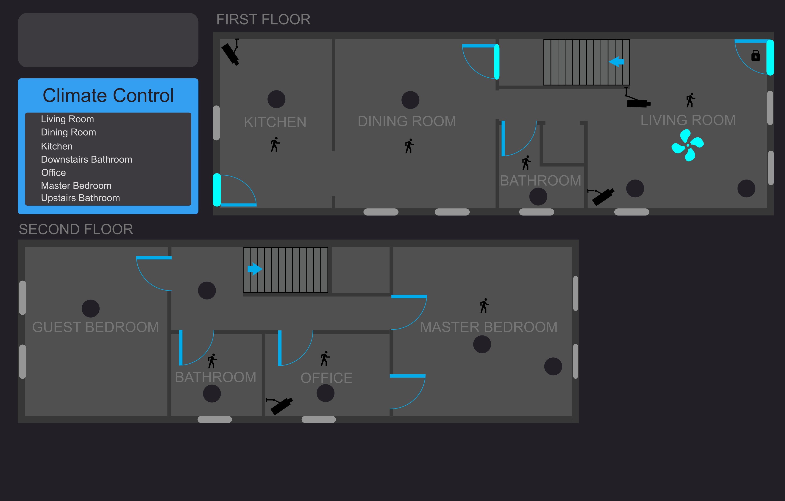

# Ryan's Smart Home 

###### LAST CHANGED: 1/24/2019

###### **Documentation is Work in Progress**

## Floor Plans

Using [HA Floorplan](https://github.com/pkozul/ha-floorplan) and [Inkscape](https://inkscape.org/)

## Platforms

### Voice Based
#### Amazon Echo
- Amazon Echo is a hands-free speaker you control with your voice. Echo connects to the Alexa Voice Service to play music, make calls, send and receive messages, provide information, news, sports scores, weather, and more—instantly. All you have to do is ask.

- Echo has seven microphones and beam forming technology so it can hear you from across the room—even while music is playing. Echo is also an expertly tuned speaker that can fill any room with 360° immersive sound. When you want to use Echo, just say the wake word “Alexa” and Echo responds instantly. If you have more than one Echo or Echo Dot, Alexa responds intelligently from the Echo you're closest to with ESP (Echo Spatial Perception).
### Application Based

#### Samsung SmartThings

- Connect wirelessly with a wide range of smart devices and make them work together.
- Monitor and control connected devices in your home using a single SmartThings app for iPhone or Android.
- Receive alerts from connected devices when there’s unexpected activity in your home.
- Automate connected devices in your home and set them to turn on or off when doors are opened, as people come and go, and much more.
- Manage connected devices in your home with SmartThings Routines for Good Morning, Goodbye, Good Night, and more.
- Control connected devices in your home with voice commands using SmartThings and Amazon Alexa or Google Home.

#### Logitech Harmony

- Harmony Hub turns your smartphone or tablet into a universal remote, giving you control over your home entertainment and smart home devices. You can change channels and volume, program favorites, control lights and other smart devices, and build multi-device experiences called Activities. Plus you can do it all even when you’re away from home.

- Harmony Hub works with over 270,000 entertainment and smart home devices so you can enjoy single-touch control with your favorite brands, right out of the box. From your TV, cable and gaming console, to your AV receiver and Roku® media player—all the way to your smart lights, locks, thermostats, and even your Alexa—Harmony Hub proudly works with just about everything.

- Control your entire home entertainment experience without lifting a finger. With Harmony and Amazon Alexa or Google Home, you can enjoy easy, hands-free control of all the things you love. Turn on your TV, change channels, control volume, or start an Activity like “Good Morning” to play a favorite music playlist, raise the blinds, set the lights, and warm the house temperature. Your voice makes it all work, just like magic.

- Lower the blinds, dim the lights, fire-up the TV for movie night—all with a tap of the finger. With Harmony Activities you can enjoy single-touch automation to trigger limitless experiences. Harmony automatically suggests everyday Activities or you can have fun creating as many as you can dream up. Time for bed? Tap “Good Night” to lock the door and turn out the lights, then fall into a deep and tranquil sleep.

### Custom Applications

#### Home Assistant *via Docker*

- Home Assistant is a home automation platform running on Python 3. It is able to track and control all devices at home and offer a platform for automating control.

# Devices
## Network Devices
<table>
    <th></th>
    <th>DESCRIPTION</th>
    <th>QTY</th>
    <tr>
        <td width=15%>
            
        </td>
        <td width=80%>
            <i>Type</i>: <b>Router</b>  
            <i>Manufacturer</i>: Netgear  
            <i>Model</i>: Nighthawk R7000  
            <i>Firmware</i>: DD-WRT v3.0-r37015M kongac (09/23/18)  
        </td>
        <td align="center" width=5%>
            <b>1</b>
        </td>
    </tr>
    <tr>
        <td width=15%>
            
        </td>
        <td width=80%>
            <i>Type</i>: <b>Network Attached Storage</b>  
            <i>Manufacturer</i>: Synology  
            <i>Model</i>: DS412+  
            <i>Firmware</i>: DSM 6.2.1 
        </td>
        <td align="center" width=5%>
            <b>1</b>
        </td>
    </tr>
</table>

## Single Board Computers (SBC)
<table>
    <th></th>
    <th>DESCRIPTION</th>
    <th>QTY</th>
    <tr>
        <td width=15%>
            
        </td>
        <td width=80%>
            <i>Type</i>: <b>Router</b>  
            <i>Manufacturer</i>: Various  
            <i>Model</i>: Raspberry Pi Zero W  
            <i>Firmware</i>: Raspbian Stretch  
        </td>
        <td align="center" width=5%>
            <b>3</b>
        </td>
    </tr>
</table>

## Development Board
<table>
    <th></th>
    <th>DESCRIPTION</th>
    <th>QTY</th>
    <tr>
        <td width=15%>
            
        </td>
        <td width=80%>
            <i>Type</i>: <b>ESP8266</b>  
            <i>Manufacturer</i>: Various  
            <i>Model</i>: ESP8266 NodeMCU LUA CP2102 ESP-12E 
            <i>Firmware</i>: Custom  
        </td>
        <td align="center" width=5%>
            <b>10</b>
        </td>
    </tr>
</table>

## Sensors
<table>
    <th></th>
    <th>DESCRIPTION</th>
    <th>QTY</th>
    <tr> 
        <td width=15%>
            
        </td>
        <td width=80%>
            <i>Type</i>: <b>Temperature and Humitidy Sensor</b>  
            <i>Manufacturer</i>: Various  
            <i>Model</i>: DHT 11 
            <i>Firmware</i>: N/A  
        </td>
        <td align="center" width=5%>
            <b>15</b>
        </td>
    </tr>
    <tr> 
        <td width=15%>
            
        </td>
        <td width=80%>
            <i>Type</i>: <b>Motion Sensor</b>  
            <i>Manufacturer</i>: Various  
            <i>Model</i>: AM312 Mini Pyroelectric PIR 
            <i>Firmware</i>: N/A  
        </td>
        <td align="center" width=5%>
            <b>15</b>
        </td>
    </tr>
    <tr> 
        <td width=15%>
            
        </td>
        <td width=80%>
            <i>Type</i>: <b>LED</b>  
            <i>Manufacturer</i>: Various  
            <i>Model</i>: RGB LED Diode Lights 
            <i>Firmware</i>: Custom  
        </td>
        <td align="center" width=5%>
            <b>100</b>
        </td>
    </tr>
    
</table>

**Pihole**  
*Manufacturer*: Vilros  
*Model*: Raspberry Pi Zero W  
*FTL Version*: v4.1  

### Cameras

### Hubs

### Lighting

### Sensors

### Locks

### Media
